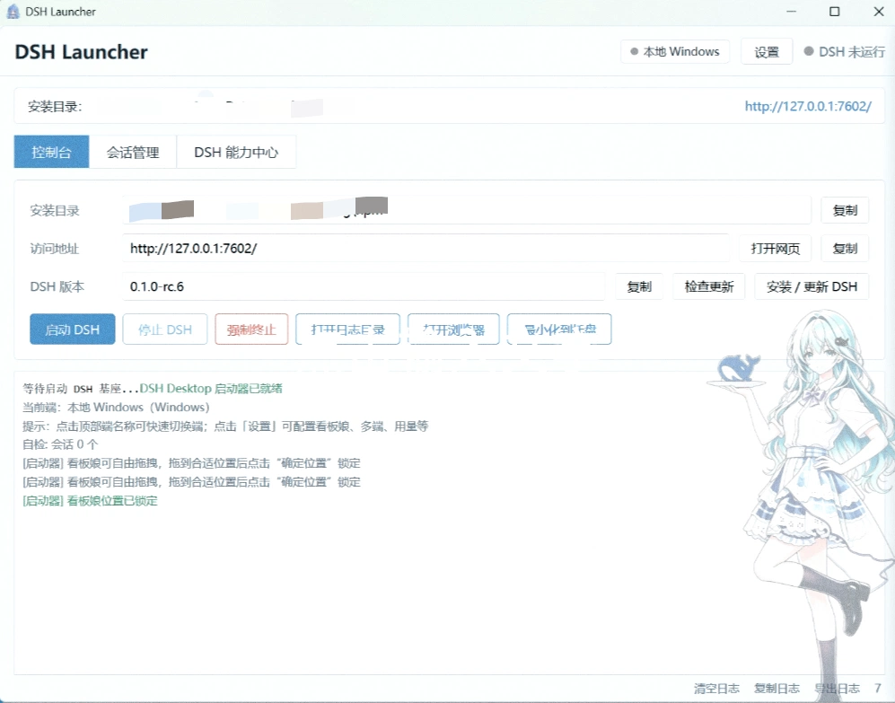

# DSH Launcher

> [中文版](README.md)

A lightweight Windows desktop launcher for [DeepSeek Harness (DSH)](https://github.com/deepseek-ai/deepseek-harness).

> Current version: **v1.0 (2026-08-17)**

It does **not** reimplement DSH and does **not** bundle Node/Electron. It wraps the globally installed `dsh` CLI into a friendlier desktop entry: async start/stop, system tray, live logs, session management, plugin marketplace, skill listing, multi-endpoint management, and crash protection.

For a detailed feature walkthrough in Chinese, see [项目介绍.md](项目介绍.md).

## Screenshots



*Console home: live logs + quick actions + endpoint switching*


*Capability Center: plugin marketplace / plugin management / skills / endpoints*

> Screenshots are from v1.0. Actual UI may differ in newer versions.

---

## Features

- **Async startup**: Launches `dsh web` in the background without blocking the UI; auto-takes over existing instances on the same port
- **System tray**: Minimize to tray on close, single-instance, quick-access tray menu
- **Live logs**: Captures DSH stdout/stderr, color-coded by level, copy/export support, auto rotation
- **Session manager**: Scans DSH sessions (zstd-compressed), groups by workspace, full-text search, Markdown export, restorable trash
- **Plugin marketplace**: Community plugin listing, one-click install/update/uninstall, auto bundle-layer sync
- **Skill manager**: Scans `SKILL.md` across directories, shows real skills and descriptions
- **Multi-endpoint**: Local Windows + WSL distros unified, real connectivity checks
- **Config editor**: Built-in `settings.yaml` and `cordis.patch.yml` editors with auto-backup on save
- **Crash protection**: Auto-restore last config on consecutive startup failures, safe mode launch
- **Kanban background**: Adjustable size/opacity/position, light-blue & white UI theme

---

## Requirements

### Required

- **Windows 10 / 11** (64-bit)
- **Microsoft Edge WebView2 Runtime** (built into Win11; may need manual install on Win10)
- **Node.js 18+** (for installing DSH)
- **DSH itself** (global install):

```powershell
npm install -g @deepseek-ai/dsh
dsh --version
```

### For building from source

- **Rust** stable (`x86_64-pc-windows-msvc`)
- **Visual Studio 2022 Build Tools** with "Desktop development with C++"

---

## Installation

### Option 1: Download prebuilt binary (recommended)

Grab the latest `dsh-launcher.exe` from the [Releases](https://github.com/LINGLIYY/DSH-Launcher/releases) page. Double-click to run — no installation needed.

> SmartScreen may warn on first run. Click "More info" → "Run anyway".

### Option 2: Build from source

```powershell
# 1. Clone
git clone https://github.com/LINGLIYY/DSH-Launcher.git
cd DSH-Launcher

# 2. Build (requires MSVC environment)
cmd /c ""C:\Program Files (x86)\Microsoft Visual Studio\2022\BuildTools\VC\Auxiliary\Build\vcvars64.bat" && cd /d %CD%\src-tauri && cargo build --release"

# 3. Run
.\src-tauri\target\release\dsh-launcher.exe
```

Artifact: `src-tauri\target\release\dsh-launcher.exe` (~7-8 MB)

---

## Quick Start

1. Ensure DSH is installed globally (see Requirements)
2. Double-click `dsh-launcher.exe`
3. Click "Start DSH" and wait for status to show "Running"
4. Click "Open DSH UI" to use DSH in your browser
5. Closing the window minimizes to tray; right-click the tray icon for quick actions

---

## Plugin Management

### Install from marketplace

1. Open "Capability Center" → "Plugin Marketplace"
2. Browse or search, click "Install"
3. Installation progress shows in the log panel; bundle layer syncs automatically
4. Restart DSH to activate

### Install local plugin

1. "Capability Center" → "Plugins" → "Import local plugin"
2. Select the plugin directory (must contain `package.json`)
3. Auto-registers into `cordis.patch.yml`

### How plugins take effect

DSH only loads packages that meet **both**:
1. The package's `package.json` declares `dsh.bundle.patch`
2. The package is listed in the profile's `dsh.profile.bundles`

The launcher syncs this automatically on install/register/open. Packages without `dsh.bundle` are labeled as "plain dependency, not loaded by DSH".

### Plugin crash safety

Installing/enabling a plugin triggers a boot probe (launches DSH on a random port to verify it doesn't crash). On failure, changes roll back automatically.

---

## Configuration

### Launcher preferences

Settings → General:
- Auto-start DSH on launch, auto-open browser when ready
- Close behavior: minimize to tray / quit
- Always on top, auto-start on boot, UI zoom (80%-130%)
- Log retention days, kanban parameters

### DSH runtime config

Settings → Runtime:
- `settings.yaml`: DSH main config
- `cordis.patch.yml`: plugin registration layer (insert/disable)

Auto-backed up before every save. Restart DSH to apply changes.

### Import / Export

Settings → Data & Maintenance → Config Import/Export:
- Choose what to export: launcher prefs / DSH runtime config / endpoints
- Exports as JSON, importable on another machine

---

## Crash Protection

Plugin or config changes can break DSH startup. Three layers of protection:

1. **Auto-backup**: Every `settings.yaml` / `cordis.patch.yml` save creates a backup (last 5 kept)
2. **Auto-restore**: 2 consecutive startup failures → restore last good backup → retry automatically
3. **Safe mode**: Manually launch with "Safe Mode" — temporarily moves current config aside and boots with defaults; original config preserved and restorable

Find backup history, manual backup, and restore in Settings → Data & Maintenance → Crash Protection & Config Backups.

---

## Data Directories

```text
%APPDATA%\dsh-launcher\
├── harness\              # DSH runtime data
│   ├── sessions\         # session files (grouped by workspace)
│   ├── sessions_trash\   # session trash
│   ├── profiles\web\     # profile config, plugins, node_modules
│   ├── settings.yaml     # DSH main config
│   ├── config-backups\   # auto config backups
│   └── config-crash-backup\  # safe mode stashed config
├── logs\
│   └── launcher.log      # launcher log (auto-rotates at 5MB)
└── launcher-prefs.json   # launcher preferences
```

Uninstalling or deleting the launcher directory does **not** affect these data.

---

## FAQ

**Q: "dsh command not found" on startup?**
A: Install DSH first with `npm install -g @deepseek-ai/dsh`, then restart the launcher.

**Q: Port 7602 is in use?**
A: By default the launcher takes over the existing instance. To change ports, go to Settings → Multi-endpoint and edit the current endpoint.

**Q: Plugin installed but not working?**
A: Check if the plugin declares `dsh.bundle.patch`. Packages without it are plain dependencies and won't be loaded by DSH. Check the activation status in plugin details.

**Q: DSH keeps failing to start?**
A: Try Settings → Crash Protection → "Safe Mode". If safe mode works, it's a config/plugin issue; restore backups one by one to isolate.

**Q: How do I use WSL endpoints?**
A: Settings → Multi-endpoint → "Auto-scan WSL". Detects `dsh` in each distro. WSL endpoints support start/stop and connectivity checks; session/plugin data still reads from the local Windows DSH_HOME.

---

## Stack

- **Shell**: Tauri 2 (Rust + system WebView2)
- **Backend**: Rust (process management, session parsing, tray, plugin management)
- **Frontend**: vanilla HTML / CSS / JavaScript (no framework, no build step)
- **DSH runtime**: globally installed `@deepseek-ai/dsh` (not bundled)

---

## License

[MIT License](LICENSE)
