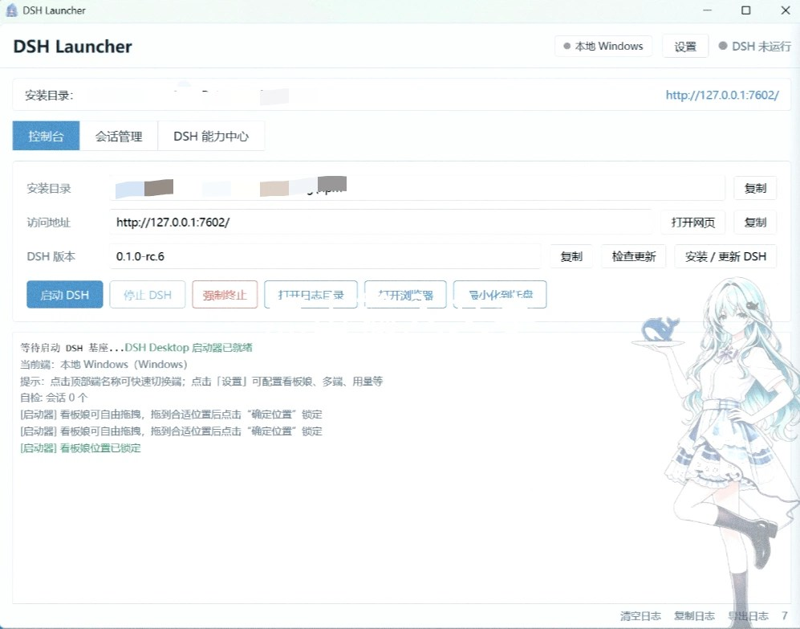
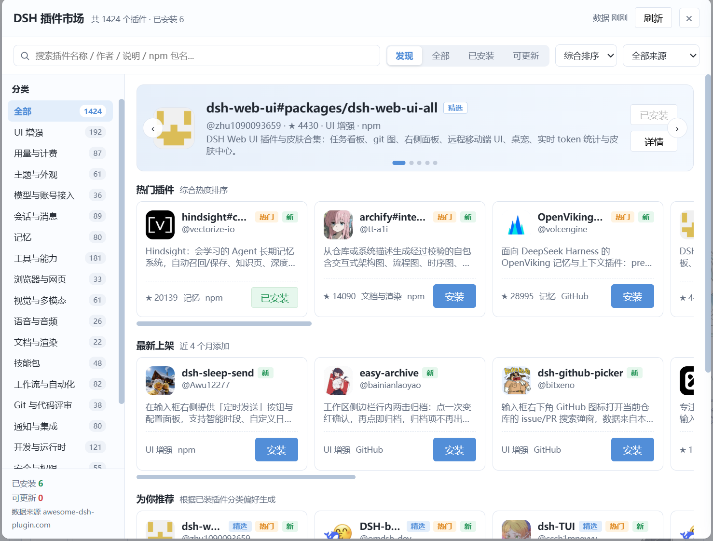

# DSH Launcher

> [English version](README.en.md)

面向 [DeepSeek Harness（DSH）](https://github.com/deepseek-ai/deepseek-harness) 的 Windows 轻量桌面启动器。

> 当前版本：**v1.0（2026-08-17）**

它**不重新实现 DSH**，也不打包 Node/Electron，而是把官方全局安装的 `dsh` 命令行工具包装成更顺手的桌面入口：异步启动/停止、系统托盘、实时日志、会话管理、插件市场、技能列表、多端管理与防崩溃保护。

## 界面预览



*控制台主页：实时日志 + 快速操作 + 端切换*



*能力中心：插件市场 / 插件管理 / 技能列表 / 多端管理*

> 截图为 v1.0 版本，实际界面以最新版本为准。

---

## 功能特性

- **异步启动**：后台拉起 `dsh web`，界面不卡死；端口被占用时自动接管已有实例
- **系统托盘**：关闭窗口最小化到托盘，单实例运行，托盘菜单直达常用操作
- **实时日志**：捕获 DSH 标准输出/错误，按级别着色，支持复制与导出，自动轮转
- **会话管理**：扫描 DSH 会话（zstd 压缩），按工作区分组，全文检索，导出 Markdown，回收站可恢复
- **插件市场**：对接社区插件列表，一键安装/更新/卸载，自动同步 bundle 层生效
- **技能管理**：扫描各目录下的 `SKILL.md`，展示真实技能与说明
- **多端管理**：本地 Windows + WSL 发行版统一管理，连通检测真实执行
- **配置编辑**：内置 `settings.yaml` 与 `cordis.patch.yml` 编辑器，保存前自动备份
- **防崩溃**：连续启动失败自动恢复最近配置备份，支持安全模式启动
- **看板娘背景**：可调尺寸/透明度/位置，浅蓝白界面风格

---

## 环境要求

### 必需

- **Windows 10 / 11**（64 位）
- **Microsoft Edge WebView2 Runtime**（Win11 自带，Win10 可能需手动安装）
- **Node.js 18+**（用于安装 DSH 本体）
- **DSH 本体**（全局安装）：

```powershell
npm install -g @deepseek-ai/dsh
dsh --version
```

### 从源码构建时额外需要

- **Rust** 稳定版（`x86_64-pc-windows-msvc`）
- **Visual Studio 2022 Build Tools**，勾选「使用 C++ 的桌面开发」

---

## 安装

### 方式一：下载预编译版本（推荐）

从 [Releases](https://github.com/LINGLIYY/DSH-Launcher/releases) 页面下载最新的 `dsh-launcher.exe`，双击即可运行，无需安装。

> 首次运行可能被 SmartScreen 拦截，选择「更多信息」→「仍要运行」即可。

### 方式二：从源码构建

```powershell
# 1. 克隆仓库
git clone https://github.com/LINGLIYY/DSH-Launcher.git
cd DSH-Launcher

# 2. 构建（需要先配置 MSVC 环境）
cmd /c ""C:\Program Files (x86)\Microsoft Visual Studio\2022\BuildTools\VC\Auxiliary\Build\vcvars64.bat" && cd /d %CD%\src-tauri && cargo build --release"

# 3. 运行
.\src-tauri\target\release\dsh-launcher.exe
```

构建产物：`src-tauri\target\release\dsh-launcher.exe`（约 7-8 MB）

---

## 快速开始

1. 确保已全局安装 DSH（见上方环境要求）
2. 双击 `dsh-launcher.exe` 启动
3. 点击「启动 DSH」按钮，等待状态变为「运行中」
4. 点击「打开 DSH 界面」在浏览器中使用 DSH
5. 关闭窗口会最小化到托盘，右键托盘图标可快速操作

---

## 插件管理

### 从市场安装

1. 打开「能力中心」→「插件市场」
2. 浏览或搜索插件，点击「安装」
3. 安装过程日志实时显示，完成后自动同步 bundle 层
4. 重启 DSH 后插件生效

### 手动安装本地插件

1. 「能力中心」→「插件管理」→「导入本地插件」
2. 选择插件目录（需包含 `package.json`）
3. 导入后自动注册到 `cordis.patch.yml`

### 插件生效机制

DSH 只加载**同时满足以下条件**的包：
1. 包内 `package.json` 声明了 `dsh.bundle.patch`
2. 已进入 profile 的 `dsh.profile.bundles` 列表

启动器在安装/注册/打开能力中心时会自动同步，未声明 `dsh.bundle` 的依赖会被标注为「普通依赖，不会被 DSH 加载」。

### 插件防崩溃

安装/启用插件时会自动做启动自检（随机端口拉起 DSH 验证不崩溃），失败则自动回滚，避免「装了插件把 DSH 玩死」。

---

## 配置说明

### 启动器偏好

在「设置」→「通用偏好」中配置：
- 启动行为：启动时自动拉起 DSH、就绪后自动开浏览器
- 关闭行为：最小化到托盘 / 直接退出
- 窗口置顶、开机自启、界面缩放（80%-130%）
- 日志保留天数、看板娘参数

### DSH 运行配置

在「设置」→「运行与用量」中编辑：
- `settings.yaml`：DSH 主配置
- `cordis.patch.yml`：插件注册层（insert/disable）

保存前自动备份，修改后重启 DSH 生效。

### 配置导入导出

「设置」→「数据与维护」→「配置导入导出」：
- 可选择导出启动器偏好 / DSH 运行配置 / 多端列表
- 导出为 JSON 文件，可在其他机器导入恢复

---

## 防崩溃机制

修改插件或配置可能导致 DSH 启动失败，启动器提供三重保护：

1. **自动备份**：每次修改 `settings.yaml` / `cordis.patch.yml` 前自动备份，保留最近 5 份
2. **自动恢复**：连续 2 次启动失败 → 自动恢复最近一份可用备份 → 自动重试
3. **安全模式**：手动点击「安全模式启动」，临时移走当前配置用默认空配置启动，原配置保留可随时恢复

在「设置」→「数据与维护」→「防崩溃与配置备份」中可查看备份历史、手动备份、恢复指定备份。

---

## 数据目录

```text
%APPDATA%\dsh-launcher\
├── harness\              # DSH 运行数据
│   ├── sessions\         # 会话文件（按工作区分组）
│   ├── sessions_trash\   # 会话回收站
│   ├── profiles\web\     # profile 配置、插件、node_modules
│   ├── settings.yaml     # DSH 主配置
│   ├── config-backups\   # 配置自动备份
│   └── config-crash-backup\  # 安全模式临时存放的原配置
├── logs\
│   └── launcher.log      # 启动器日志（超过 5MB 自动轮转）
└── launcher-prefs.json   # 启动器偏好
```

卸载或删除启动器目录**不会**影响以上数据。

---

## 常见问题

**Q：启动时提示「未找到 dsh 命令」**
A：请先执行 `npm install -g @deepseek-ai/dsh` 安装 DSH 本体，然后重启启动器。

**Q：端口 3080 被占用怎么办？**
A：默认会自动接管已有实例。如需更换端口，在「设置」→「多端管理」中修改当前端端口。

**Q：插件装了但不生效？**
A：检查插件是否声明了 `dsh.bundle.patch`。未声明的包只是普通依赖，DSH 不会加载。可在插件详情中查看生效状态。

**Q：DSH 一直启动失败？**
A：尝试「设置」→「防崩溃」→「安全模式启动」。如果安全模式能启动，说明是配置或插件问题，可逐次恢复备份定位原因。

**Q：WSL 端怎么用？**
A：「设置」→「多端管理」→「自动扫描 WSL」，会检测各发行版中的 `dsh` 路径。WSL 端支持启停与连通检测，会话/插件数据仍读取本机 Windows 的 DSH_HOME。

---

## 技术栈

- **桌面壳**：Tauri 2（Rust + 系统 WebView2）
- **后端**：Rust（进程管理、会话解析、托盘、插件管理）
- **前端**：原生 HTML / CSS / JavaScript（无框架，无构建步骤）
- **DSH 本体**：全局安装的 `@deepseek-ai/dsh`（不在启动器内打包）

---

## 许可证

[MIT License](LICENSE)
